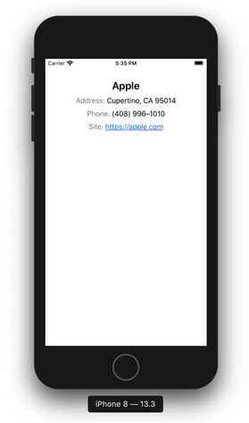

# StringEx

`StringEx` makes it easy to create `NSAttributedString` and manipulate `String`.

## Table of contents

* [Quick Example](#quick-example)
* [Installation](#installation)
* [Initialization](#initialization)
* [String selectors](#string-selectors)
	* [HTML tags](#html-tags)
	* [Substrings](#substrings)
	* [Regular expressions](#regular-expressions)
	* [Ranges](#ranges)
	* [Reset](#reset)
	* [Nested selectors](#nested-selectors)
	* [Selectors union](#selectors-union)
	* [Filtering selectors](#filtering-selectors)
	* [Priority](#priority)
* [Getters](#getters)
	* [Selector](#selector)
	* [String](#string)
	* [NSAttributedString](#nsattributedstring)
* [Manipulations](#manipulations)
	* [Concatenation](#concatenation)
	* [Replacing](#replacing)
	* [Appending](#appending)
	* [Prepending](#prepending)
	* [Inserting](#inserting)
* [Styling](#styling)
	* [Using styles](#using-styles)
	* [Clearing styles](#clearing-styles)
	* [Stylesheets](#stylesheets)
	* [Style Manager](#style-manager)

## Quick Example

This simple example allows you to understand what the library actually does.

```swift
let string = "<title /><address class=\"line\">Address: Cupertino, CA 95014</address><phone class=\"line\">Phone: (408) 996–1010</phone><site class=\"line\">Site: https://apple.com</site>"

// Create StringEx instance
let ex = string.ex

// Apply default styles to whole string
ex.style([
    .font(.systemFont(ofSize: 17.0)),
    .color(.black)
])

// Insert company name and style it
ex[.tag("title")]
    .insert("Apple")
    .style(.font(.boldSystemFont(ofSize: 24.0)))

// Add new lines to each tag with `line` class
ex[.class("line")].prepend("\n")

// Add some space before each paragraph and set text aligment
ex[.all].style([
    .paragraphSpacingBefore(10.0),
    .aligment(.center)
])

// Get site url
let selector = .tag("site") => .regex("(?i)https?://(?:www\\.)?\\S+(?:/|\\b)")
let url = ex[selector].selectedString

// Attach url to site link and style it
ex[selector].style([
    .linkString(url),
    .color(.blue),
    .underlineStyle(.single, color: .blue)
])

// Apply gray color to contacts captions
ex[.string("address:") + .string("phone:") + .string("site:")].style(.color(.gray))

// Get result attributed string
let attributedString = ex.attributedString

// and display it in TextView
textView.attributedText = attributedString
textView.dataDetectorTypes = .link
```
As a result, we get something like:



## Installation

* Requires:
	* iOS 10.0+
	* Swift 5.2 (Xcode 11.4+)
* Dependencies:
	* None

### CocoaPods

You can use [CocoaPods](https://cocoapods.org/) to install `StringEx` by adding it to your `Podfile`:

```ruby
platform :ios, '10.0'
use_frameworks!

target 'MyApp' do
    pod 'StringEx'
end
```

## Initialization

First of all include the library in your swift file:

```swift
import StringEx
```

Creating `StringEx` instance:

```swift
// Creating with an initializer from a string
var ex = StringEx(string: "Hello, World!")

// Creating with an initializer from a NSAttributedString
ex = StringEx(attributedString: NSAttributedString(string: "Hello, World!"))

// Shorthand method for string
ex = "Hello, World!".ex

// Shorthand method for NSAttributedString
ex = NSAttributedString(string: "Hello, World!").ex
```

## String selectors

String selectors are the :heart: &nbsp;of the library. With selectors, you can select sub-ranges of a string in different ways and in a uniform manner. Various manipulations can be performed on the selected substrings, such as deleting, replacing, adding other strings, and applying styles.

There are two ways to execute selectors:

```swift
let ex = "Hello, World!".ex

// Using select method
ex.select(.string("world")).style(.color(.red))

// or using subscript on StringEx instance
ex[.string("world")].style(.color(.red))
```

These methods set an internal pointer to the passed selector and return the same object. This allows you to chain other methods (on the same instance) within a single statement.

> The result of executing the selector is an array of ranges sorted by their lower bound. If there are overlapping ranges as a result, they are combined into one range.

The following types of selectors are available:

### HTML tags

`StringEx` can process HTML strings, allowing you to select substrings within HTML tags by tag name, class or identifier. HTML tags syntax must conform to the specification available at [https://html.spec.whatwg.org/multipage/syntax.html](https://html.spec.whatwg.org/multipage/syntax.html)

```swift
let ex = "Example: <p id="example"><span class="word1">Hello</span>, <span class="word2">World</span>!</p>".ex

// Select by tag name
let str1 = ex[.tag("span")].selectedString
print(str1) // HelloWorld

// Select by tag class
let str2 = ex[.class("word1")].selectedString
print(str2) // Hello

// Select by tag identifier
let str3 = ex[.id("example")].selectedString
print(str3) // Hello, World!
```

You can also use self-closing tags:

```swift
let ex = "Hello, <name />!".ex
let str = ex[.tag("name")].insert("World").string
print(str) // Hello, World!
```

### Substrings

```swift
let ex = "Hello, World!".ex

// Case insensitive search
let str1 = ex[.string("hello")].selectedString
print(str1) // Hello

// Case sensitive search
let str2 = ex[.string("World", caseInsensitive: false)].selectedString
print(str2) // World

let str3 = ex[.string("world", caseInsensitive: false)].selectedString
print(str3.isEmpty) // true
```

### Regular expressions

```swift
let ex = "Hello, World!".ex

// Select only latin symbols
let str1 = ex[.regex("[a-zA-Z]")].selectedString
print(str1) // HelloWorld

// Using NSRegularExpression.Options
let str2 = ex[.regex("[a-z]", options: [.caseInsensitive])].selectedString
print(str2) // HelloWorld
```

### Ranges

`StringEx` uses a `Range<Int>` to work with ranges. The index corresponds to each displayed character in the string, where the first character is at index`0`, the last is at index `string.count - 1`

> In HTML strings, indices correspond to characters in a string without tags

```swift
let ex = "Hello, World!".ex

// Select first 5 symbols
let str1 = ex[.range(0..<5)].selectedString
print(str1) // Hello

// It is safe to pass a range that is out of range
let str2 = ex[.range(-Int.max..<Int.max)].selectedString
print(str2) // Hello, World!
```

### Reset

In addition to the above selectors, there is also the `.all` selector that allows you to select the entire string.

```swift
let ex = "<span>Hello</span>, World!".ex

let str1 = ex[.tag("span")].selectedString
print(str1) // Hello

// Reset selector
let str2 = ex[.all].selectedString
print(str2) // Hello, World!
```

### Nested selectors

You can use nested selectors to search within the parent selector.

```swift
// Select first character of each span tag
let selector1: StringSelector = .tag("span").select(.range(0..<1))

// or do the same using the shorthand operator =>
let selector2: StringSelector = .tag("span") => .range(0..<1)

print(selector1 == selector2) // true
```

```swift
let ex = "<b><span>Hello</span></b>, <span><b>World</b></span>!".ex
let str = ex[.tag("span") => .tag("b") => .range(0..<1)].selectedString
print(str) // W
```

### Selectors union

You can combine multiple selectors into one to perform searches within a single statement.

```swift
// Select inner contents of each span and em tags
let selector1: StringSelector = .tag("span").add(.tag("em"))

// or do the same using the shorthand operator +
let selector2: StringSelector = .tag("span") + .tag("em")

print(selector1 == selector2) // true
```

```swift
let ex = "<span>Hello</span>, <em>World</em>!".ex
let str = ex[.tag("span") + .tag("em")].selectedString
print(str) // HelloWorld
```

### Filtering selectors

You can filter the results of the selectors to get the desired result subset.

```swift
// Get the first result of the selector
let selector1: StringSelector = .tag("span").filter(.first)

// or do the same using the shorthand operator %
let selector2: StringSelector = .tag("span") % .first

print(selector1 == selector2) // true
```

```swift
let ex = "<b>H</b><b>e</b><b>l</b><b>l</b><b>o</b>, <b>W</b><b>o</b><b>r</b><b>l</b><b>d</b>!".ex

// Reduces the set of the selector results to the first in the set
let str1 = ex[.tag("b") % .first].selectedString
print(str1) // H

// Reduces the set of the selector results to the last in the set
let str2 = ex[.tag("b") % .last].selectedString
print(str2) // d

// Reduces the set of the selector results to the one at the specified index
let str3 = ex[.tag("b") % .eq(5)].selectedString
print(str3) // W

// Reduces the set of the selector results to even ones in the set
let str4 = ex[.tag("b") % .even].selectedString
print(str4) // Hlool

// Reduces the set of the selector results to odd ones in the set
let str5 = ex[.tag("b") % .odd].selectedString
print(str5) // elWrd

// Select all selector results at the index greater than index within the set
let str6 = ex[.tag("b") % .gt(4)].selectedString
print(str6) // World

// Select all selector results at the index less than index within the set
let str7 = ex[.tag("b") % .lt(5)].selectedString
print(str7) // Hello
```

### Priority

You can change the order of the operators using parentheses similar to the conventional arithmetic expressions. Operators `=>` and `%` have the same priority and it is greater than operator `+` priority.

```swift
let ex = "<span><b>Hello</b></span>, <em><b>World</b></em>!".ex

let selector1: StringSelector = .tag("span") + .tag("em") => .range(0..<1)
print(ex[selector1].selectedString) // HelloW

let selector2: StringSelector = (.tag("span") + .tag("em")) => .range(0..<1)
print(ex[selector2].selectedString) // HW

let selector3: StringSelector = .tag("span") => .tag("b") % .last
print(ex[selector3].selectedString) // Hello

let selector4: StringSelector = .tag("span") => (.tag("b") % .last)
print(ex[selector4].selectedString.isEmpty) // true
```

## Getters

`StringEx` has several useful properties and methods to get all the information you need.

### Selector

```swift
let ex = "<span>Hello</span>, <span>World</span>!".ex

// Get the current selector
print(ex.selector) // all

ex.select(.tag("span"))

// Get the current selector
print(ex.selector) // tag("span")

// Get the number of found sub-ranges
print(ex.count) // 2
```

### String

To get the original string (with HTML tags), you can use the `rawString` property. When creating an `StringEx` instance containing HTML tags, the library tries to fix possible markup errors, such as missing end tags, etc. In this case, the `rawString` property will contain the corrected HTML string.

```swift
let ex = "Hello, <b>World!".ex
print(ex.rawString) // Hello, <b>World!</b>
```

To get the entire `String` without HTML tags, you can use the `string` property. This property always contains the entire string, regardless of the current selector applied to the `StringEx` instance.

```swift
let ex = "Hello, <b>World</b>!".ex

print(ex.string) // Hello, World!

ex.select(.tag("b"))

print(ex.string) // Hello, World!
```

You can use the `selectedString` property or `selectedString(separator: String)` method to retrieve only the selected sub-ranges of a string. 

> Because the result of the selector is an array of sub-ranges, then to get the selected string, you have to pass a separator that will be used to combine the selected substrings. In the case of using the `selectedString` property, the separator is an empty string `""` by default.

```swift
let ex = "<span>Hello</span>, <span>World</span>!".ex

ex.select(.tag("span"))

// Using the property
print(ex.selectedString) // HelloWorld

// Using the method
print(ex.selectedString(separator: "-")) // Hello-World

// Overlapping ranges are combined into one
ex.select(.tag("span") + .range(0..<2) + .range(8..<Int.max))
print(ex.selectedString) // HelloWorld!

```

### NSAttributedString

You can get `NSAttributedString` with apllied styles containing both the entire string without HTML tags, and only the selected part using selectors. The library always returns a new `NSAttributedString` instance, so it can be safely used right away without having to create a copy of the `NSAttributedString` instance.

```swift
let ex = "<span>Hello</span>, <span>World</span>!".ex

ex[.tag("span")].style(.color(.red))

// Get NSAttributedString containing the entire string
let attributedString1 = ex.attributedString
print(attributedString1.string) // Hello, World!

// Get NSAttributedString containing only the selected substring
let attributedString2 = ex.selectedAttributedString
print(attributedString2.string) // HelloWorld

// Get NSAttributedString containing only the selected substring using separator
let attributedString3 = ex.selectedAttributedString(separator: "-")
print(attributedString3.string) // Hello-World
```

## Manipulations

### Concatenation

You can create new `StringEx` instances by concatenating with other `StringEx` instances as well as `String` and `NSAttributedString`.

```swift
let helloEx = "Hello".ex
let worldEx = "World".ex
let exclamationAttributed = NSAttributedString(string: "!", attributes: [.foregroundColor: UIColor.red])

let ex = helloEx + ", " + worldEx + exclamationAttributed
        
print(ex.rawString) // Hello, World!
```

### Replacing

You can replace selected substrings with other `StringEx` instances, `String` or `NSAttributedString`. 

> If you use a selector by HTML tag, then the result of its work is the inner content of the tag, so the replacement affects only the inner content and leaves the tag itself in the original string.

```swift
let ex = "Hello, <span>World</span>!".ex
let str = ex[.tag("span")].replace(with: "Big World").rawString
print(str) // Hello, <span>Big World</span>!
```

There is also an optional `mode` parameter in the `replace` method. This parameter can take two values `.outer` (default) / `.inner` and is responsible for the mode of converting the selected ranges in the HTML string. This example shows the difference when using the `mode` parameter:

```swift
let ex = "Hello, <span><b></b></span>!".ex

let str1 = ex[.tag("span")].replace(with: "World", mode: .outer).rawString
let str2 = ex[.tag("span")].replace(with: "World", mode: .inner).rawString

print(str1) // Hello, <span>World</span>!
print(str2) // Hello, <span><b>World</b></span>!
```

### Appending

You can insert the passed `StringEx`, `String` or `NSAttributedString` at the end of each currently selected sub-ranges of the string using the `append` method:

```swift
let ex = "<span>Hello</span>, <span>World</span>!".ex
let str = ex[.tag("span")].append("?").rawString
print(str) // <span>Hello?</span>, <span>World?</span>!
```

### Prepending

You can insert the passed `StringEx`, `String` or `NSAttributedString` at the beginning of each currently selected sub-ranges of the string using the `prepend` method:

```swift
let ex = "<span>Hello</span>, <span>World</span>!".ex
let str = ex[.tag("span")].prepend("?").rawString
print(str) // <span>?Hello</span>, <span>?World</span>!
```

### Inserting

You can insert the passed `StringEx`, `String` or `NSAttributedString` at the specified index of each currently selected sub-ranges of the string using the `insert` method:

```swift
let ex = "<span>Hello</span>, <span>World</span>!".ex
let str = ex[.tag("span")].insert("?", at: 2).rawString
print(str) // <span>He?llo</span>, <span>Wo?rld</span>!
```

You can also omit the `index` parameter to insert the value into an empty HTML tag.

```swift
let ex = "Hello, <span />!".ex
let str = ex[.tag("span")].insert("World").rawString
print(str) // Hello, <span>World</span>!
```

## Styling

### Using styles

You can apply different styles to selected substrings of `StringEx` instance like this:

```swift
let ex = "Hello, <span>World</span>!".ex

// Apply single style
ex[.tag("span")].style(.color(.red))

// or an array of styles
ex[.tag("span")].style([
	.font(.systemFont(ofSize: 17.0)),
	.color(.red),
	.backgroundColor(.green)
])
```

The following list of styles is available for use:

Style | Description
--- | ---
`.font(_ font: UIFont)` | The font of the selected text
`.color(_ color: UIColor)` | The color of the selected text
`.backgroundColor(_ color: UIColor)` | The color of the background area behind the selected text
`.kern(_ value: Double)` | The number of points by which to adjust kern-pair characters
`.linkUrl(_ url: URL?)` | The link of the selected text
`.linkString(_ string: String?)` | The link of the selected text
`.shadow(_ shadow: NSShadow?)` | The shadow of the selected text
`.lineThroughStyle(_ style: NSUnderlineStyle, color: UIColor? = nil)` | The line through style and color
`.lineThroughStyles(_ styles: [NSUnderlineStyle], color: UIColor? = nil)` | The line through styles and color
`.underlineStyle(_ style: NSUnderlineStyle, color: UIColor? = nil)` | The underline style and color
`.underlineStyles(_ styles: [NSUnderlineStyle], color: UIColor? = nil)` | The underline styles and color
`.strokeWidth(_ width: Double, color: UIColor? = nil)` | The stroke of the selected text
`.baselineOffset(_ value: Double)` | The character’s offset from the baseline, in points
`.paragraphStyle(_ value: NSParagraphStyle)` | The paragraph attributes
`.aligment(_ value: NSTextAlignment)` | The text alignment
`.firstLineHeadIndent(_ value: Double)` | The indentation of the first line
`.headIndent(_ value: Double)` | The indentation of the lines other than the first
`.tailIndent(_ value: Double)` | The trailing indentation
`.lineHeightMultiple(_ value: Double)` | The line height multiple
`.lineSpacing(_ value: Double)` | The distance in points between the bottom of one line fragment and the top of the next
`.paragraphSpacing(_ value: Double)` | The space after the end of the paragraph
`.paragraphSpacingBefore(_ value: Double)` | The distance between the paragraph’s top and the beginning of its text content

> Using `aligment`, `firstLineHeadIndent`, `headIndent`, `tailIndent`, `lineHeightMultiple`, `lineSpacing`, `paragraphSpacing`, `paragraphSpacingBefore` styles creates `NSParagraphStyle` object with appropriate attributes. Therefore, reapplying these styles will completely overwrite this object.

### Clearing styles

```swift
let ex = "Hello, <span>World</span>!".ex

// Apply style to entire string
ex.style(.color(.red))

// Clear styles for span tag
ex[.tag("span")].clearStyles()
```

### Stylesheets

You can store common styles in a variable and apply them in multiple `StringEx` instances to avoid code duplication.

```swift
let styles = [
	Stylesheet(selector: .tag("b"), styles: [
		.font(.boldSystemFont(ofSize: 24.0)),
		.color(.black)
	]),
	Stylesheet(selector: .tag("em"), style: .font(.italicSystemFont(ofSize: 17.0)))
]

let ex1 = "Hello, <b>World</b>!".ex
let ex2 = "<em>Hello</em>, <b>World</b>!".ex

ex1.style(styles)
ex2.style(styles)
```

> Styles will be applied in the order in which they are listed in the array.

### Style Manager

The Style Manager is a centralized repository of styles grouped into themes. The Style Manager allows you to automatically apply the selected style theme to `StringEx` instances.

First of all, you need to add some styles to the Style Manager and specify the theme name:

```swift
// Set heading styles
StyleManager.shared.set("heading", [
    Stylesheet(selector: .tag("h1"), styles: [
        .font(.boldSystemFont(ofSize: 24.0)),
        .color(.black)
    ]),
    Stylesheet(selector: .tag("h2"), styles: [
        .font(.boldSystemFont(ofSize: 18.0)),
        .color(.gray)
    ])
])

// Set paragraph styles
// You can use subscript to set the styles
StyleManager.shared["paragraph"] = [
    Stylesheet(selector: .tag("p"), styles: [
        .font(.systemFont(ofSize: 17.0)),
        .color(.black)
    ])
]

// You can combine multiple themes into one
StyleManager.shared.set("default", ["heading", "paragraph"])
```

You can set or change the current theme as follows:

```swift
StyleManager.shared.use("default")
```

In order for a specific `StringEx` instance to use the Style Manager, you need to set the property `useStyleManager = true`

```swift
let str = """
<h1>Page title</h1>
<p>Some text.</p>
<p>Some text.</p>
<h2>Title</h2>
<p>Some text.</p>
"""

let ex = str.ex
ex.useStyleManager = true

// After that, when you access the property to get the NSAttributedString, 
// the styles will be automatically applied to it
myLabel.attributedText = ex.attributedString
```